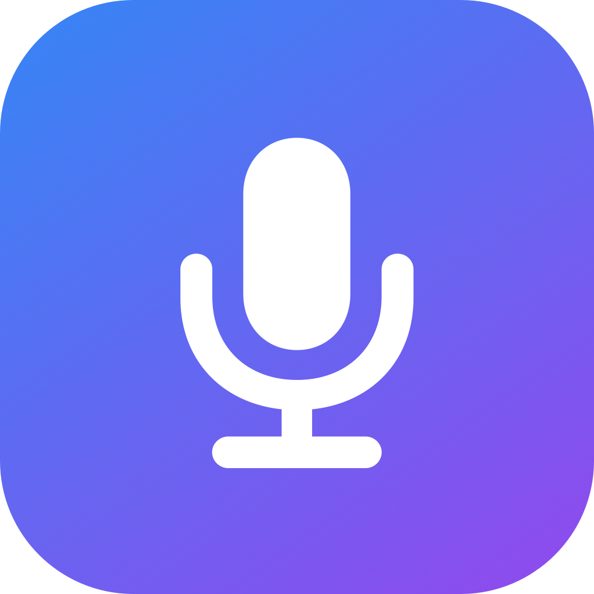

# VibeTalk

<p align="center">
  
</p>

macOS 菜单栏语音输入工具：按住全局热键说话，松手后本地语音识别转文字，自动粘贴到当前输入框。为 vibecoding 场景设计（中英混合、编程术语优化）。

完全本地运行，基于 [whisper.cpp](https://github.com/ggml-org/whisper.cpp) + Metal GPU 加速，无网络依赖（仅首次下载模型需要联网）。

## 功能

- **按住说话**：按住右 ⌘Command（可切换 右⌥Option / 右⇧Shift / Fn）开始录音，松手自动识别并粘贴
- **本地识别**：whisper medium-q8_0 模型，Metal 加速；中英混合优化，内置编程术语引导词
- **自动粘贴**：写入剪贴板并模拟 Cmd+V 输入到当前焦点输入框（粘贴前自动备份剪贴板，粘贴后恢复）
- **麦克风**：默认跟随系统输入设备，可手动指定蓝牙耳机等；热插拔自动刷新
- **状态可见**：录音时菜单栏图标绿色圆底、识别中橙色；开始录音有提示音

## 运行条件

| 项目 | 要求 |
|---|---|
| 系统 | macOS 14 及以上（约 2018 年后的 Mac） |
| 架构 | Apple Silicon / Intel（Universal 双架构） |
| 权限 | 麦克风（必需）、辅助功能（自动粘贴必需） |
| 网络 | 仅首次下载模型需要 |

> **老 Mac 兼容性**：识别默认走 Metal GPU 加速；Metal 覆盖所有支持 macOS 14 的机型，即使个别老 GPU 初始化失败，也会自动回落纯 CPU 推理（功能正常，速度变慢）。

## 资源占用

| 项目 | 占用 |
|---|---|
| 磁盘 | 模型 ~785MB + 应用 ~3MB |
| 内存 | 模型常驻 ~1GB（加载后） |
| CPU/GPU | 空闲时≈0；识别时 Metal GPU 数秒（M1 Pro 上 3-5s 音频约 1-2s 出结果） |
| 后台活动 | 仅菜单栏驻留 + 全局热键监听，无持续网络/磁盘活动 |

## 安装与首次运行

本应用未使用 Apple Developer Program 证书签名（自签名），从网络下载或拷贝获得的 .app 首次打开时会被 Gatekeeper 拦截（"无法确认开发者身份"）。任选一种方式放行：

1. **右击打开**：Finder 中右击 VibeTalk.app → 打开 → 在弹窗中点"打开"（只需一次）
2. **系统设置放行**：双击被拦后，去 系统设置 → 隐私与安全性 → 安全性 → 点"仍要打开"
3. **命令行移除隔离属性**：

```bash
xattr -dr com.apple.quarantine /path/to/VibeTalk.app
```

> 本机自行构建（`scripts/package_app.sh`）的产物不带隔离属性，可直接运行，无需上述操作。

### 首次使用

1. 启动后授予**麦克风权限**
2. 首次识别前需下载模型（medium-q8_0，~785MB，菜单内一键下载）
3. 菜单中点击**开启辅助功能权限**（用于模拟粘贴；未授权时降级为仅复制剪贴板 + 通知）
4. 在任意输入框按住右 ⌘Command 说话，松手即得文字

## 构建与开发

见 [docs/BUILDING.md](docs/BUILDING.md)：编译打包、自签名证书、识别质量测试工装、调试模式、目录结构与技术决策记录。

## 更新日志

见 [CHANGELOG.md](CHANGELOG.md)。
